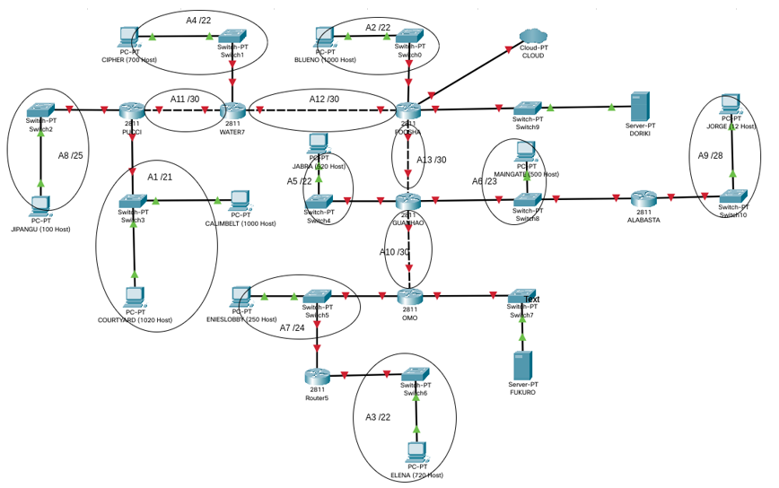

# jarkom-modul-4-A07-2021

## VLSM

**No**|**Nama**|**Jumlah Host**|**Subnet**|**Max Host**|**Netmask**|**IP Network**|**IP Awal**|**IP Akhir**|**IP Broadcast**|**Nama**
:-----:|:-----:|:-----:|:-----:|:-----:|:-----:|:-----:|:-----:|:-----:|:-----:|:-----:|
1|A1 (COURTYARD & CALIMBELT)|2021|/21|2048|255.255.248.0|192.172.0.0|192.172.0.1|192.172.7.254|192.172.7.255|A1(COURTYARD & CALIMBELT)|
2|A2 (BLUENO)|1001|/22|1024|255.255.252.0|192.172.8.0|192.172.8.1|192.172.11.254|192.172.11.255|A2(BLUENO)|
3|A3 (ELENA)|721|/22|1024|255.255.252.0|192.172.12.0|192.172.12.1|192.172.15.254|192.172.15.255|A3 (ELENA)|
4|A4 (CIPHER)|701|/22|1024|255.255.252.0|192.172.16.0|192.172.16.1|192.172.19.254|192.172.19.255|A4 (CIPHER)|
5|A5 (JABRA)|521|/22|1024|255.255.252.0|192.172.20.0|192.172.20.1|192.172.23.254|192.172.23.255|A5 (JABRA)|
6|A6 (MAINGATE)|501|/23|512|255.255.254.0|192.172.24.0|192.172.24.1|192.172.25.254|192.172.25.255|A6 (MAINGATE)|
7|A7 (ENIESLOBBY)|251|/24|256|255.255.255.0|192.172.26.0|192.172.26.1|192.172.26.254|192.172.26.255|A7 (ENIESLOBBY)|
8|A8 (JIPANGU)|101|/25|128|255.255.255.128|192.172.27.0|192.172.27.1|192.172.27.125|192.172.27.127|A8 (JIPANGU)|
9|A9 (JORGE)|13|/28|16|255.255.255.240|192.172.27.128|192.172.27.129|192.172.27.142|192.172.27.143|A9 (JORGE)|
10|A10 (OMO)|2|/30|4|255.255.255.252|192.172.27.144|192.172.27.145|192.172.27.146|192.172.27.147|A10 (OMO)|
11|A11 (PUCCI)|2|/30|4|255.255.255.252|192.172.27.148|192.172.27.149|192.172.27.150|192.172.27.151|A11 (PUCCI)|
12|A12 (WATER7)|2|/30|4|255.255.255.252|192.172.27.152|192.172.27.153|192.172.27.154|192.172.27.155|A12 (WATER7)|
13|A13 (GUANHOU)|2|/30|4|255.255.255.252|192.172.27.156|192.172.27.157|192.172.27.158|192.172.27.159|A13 (GUANHOU)|

