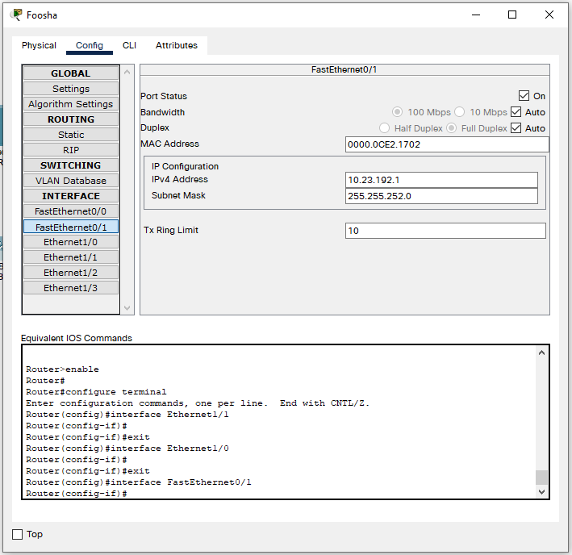
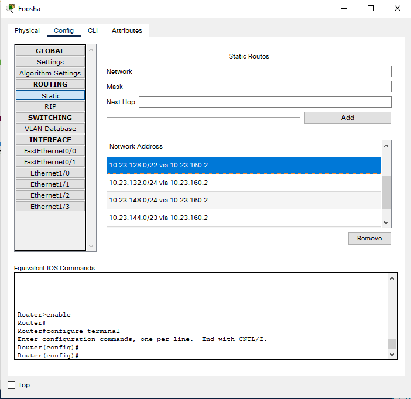

# Jarkom-Modul-4-A07-2021

Laporan resmi berisi dokumentasi soal Jarkom Modul 3.
---
Kelompok A-07:
- [Arkan Aulia Farhan](): 05111940000128
- [Muchamad Maroqi Abdul Jalil](https://github.com/maroqijalil): 05111940000143
- [Syamil Difaul Haq Sukur](https://github.com/Syamil28): 05111940000196
---

# MODUL 4


## Routing dan Subnetting dengan CISCO

### CIDR

1. Membuat Topology-nya terlebih dahulu pada CISCO

2. Memilih Subnet yang paling optimal


3. Hitung panjang setiap Subnet


4. menggabungkan subnet paling bawah di dalam topologi. Paling bawah berarti subnet yang paling jauh dari internet (gambar awan). Gabungkan hingga tersisa 1 buah Subnet.


5. Menghitung Pembagian IP dengan Pohon.


6. Membuat tabel pembagian IP


### Configure

1. Konfigurasi Router

setiap router di config sesuai arah kabel terhadap subnet.

sebagai contoh pada router Foosha akan di konfig terhadap **A5** (mengarah ke router Water7). maka router Foosha akan mengambil salah satu IP dari **A5** dan menggunakan subnet mask **A5** pada kabel yang mengarah ke Water7.


Sementara untuk router Water7 akan mengambil IP pada **A5** yang belum diambil oleh Foosha pada kabel yang mengarah ke Foosha.


Lakukan hingga semua Subnet Terpenuhi.

2. Konfigurasi Host (PC)

untuk konfigurasi PC, Menggunakan IP pada Subnet yang tersambung pada PC tersebut.

sebagai contoh pada PC BLUENO yang terdapat pada subnet A6 Menggunakan IP pada A6 tetapi yang tidak dipakai oleh Router yang tersambung pada A6. sedangkan untuk gateway-nya, menggunakan IP dari Router yang tersambung pada A6.




Lakukan pada Semua PC.

### Routing

Karena Foosha merupakan persimpangan yang paling ideal, maka routing akan dilakukan dari Foosha ke seluruh PC yang tidak satu subnet dengan Foosha.

sebagai contoh Foosha (Router) - Elena (PC).

Elena berada pada subnet A13, maka Network dan Mask pada Foosha akan diisi NID dan Net Mask dari A13 sementara Next Hop akan diisi oleh IP dari Router yang mengarah ke Foosha dimana dalam hal ini adalah Router GUANHAO dengan kabel yang mengarah ke Foosha (Subnet A7).



setting pula pada setiap router yang dilewati oleh Foosha untuk sampai ke Elena (GUANHAO, OIMO). 


pada router SEASTONE akan disetting **Default Routing** untuk kembali ke router OIMO. OIMO juga akan ditambahkan **Default Routing** untuk kembali ke router GUANHAO. dan GUANHAO juga akan ditambahkan **Default Routing** untuk kembali ke router Foosha. sehinnga Foosha dapat mengenali Elena (PC).

SEASTONE Default Routing


Lakukan hingga Foosha mengenali seluruh PC.

## Routing dan Subnet pada GNS

### VLSM

1. Membuat Topology-nya 


2. Memilih Subnet Paling Optimal


3. Tentukan jumlah alamat IP yang dibutuhkan oleh tiap subnet dan lakukan labelling netmask berdasarkan jumlah IP yang dibutuhkan.


4. Buat pohon pembagian IP


5. Membuat tabel pembagian IP


### Configure

1. Konfigurasi Router

FOOSHA :
```bash
# Static config for eth0
auto eth0
iface eth0 inet static
	address 10.23.4.1
	netmask 255.255.252.0

# Static config for eth1
auto eth1
iface eth1 inet static
	address 10.23.0.5
	netmask 255.255.255.252

Static config for eth2
auto eth2
iface eth2 inet static
#	address 192.168.2.2
        address 10.23.0.1
#	netmask 255.255.255.0
	netmask 255.255.255.252

# Static config for eth3
auto eth3
iface eth3 inet static
	address 10.23.0.13
	netmask 255.255.255.252

# DHCP config for eth4
auto eth4
iface eth4 inet dhcp
```

WATER7 :
```bash
# Static config for eth0
auto eth0
iface eth0 inet static
	address 10.23.8.1
	netmask 255.255.252.0

# Static config for eth1
auto eth1
iface eth1 inet static
	address 10.23.0.9
	netmask 255.255.255.252

# Static config for eth2
auto eth2
iface eth2 inet static
	address 10.23.0.6
	netmask 255.255.255.252
```

PUCCI :
```bash
# Static config for eth0
auto eth0
iface eth0 inet static
	address 10.23.0.10
	netmask 255.255.255.252

# Static config for eth1
auto eth1
iface eth1 inet static
	address 10.23.0.129
	netmask 255.255.255.128

# Static config for eth2
auto eth2
iface eth2 inet static
	address 10.23.24.1
	netmask 255.255.248.0
```

GUANHAO :
```bash
# Static config for eth0
auto eth0
iface eth0 inet static
	address 10.23.0.14
	netmask 255.255.255.252

# Static config for eth1
auto eth1
iface eth1 inet static
	address 10.23.12.1
	netmask 255.255.252.0

# Static config for eth2
auto eth2
iface eth2 inet static
	address 10.23.0.17
	netmask 255.255.255.252

# Static config for eth3
auto eth3
iface eth3 inet static
	address 10.23.2.1
	netmask 255.255.254.0
```

ALABASTA :
```bash
# Static config for eth0
auto eth0
iface eth0 inet static
	address 10.23.2.2
	netmask 255.255.254.0

# Static config for eth1
auto eth1
iface eth1 inet static
	address 10.23.0.33
	netmask 255.255.255.240
```

OIMO :
```bash
# Static config for eth0
auto eth0
iface eth0 inet static
	address 10.23.0.18
	netmask 255.255.255.252

# Static config for eth1
auto eth1
iface eth1 inet static
	address 10.23.0.21
	netmask 255.255.255.252

# Static config for eth2
auto eth2
iface eth2 inet static
	address 10.23.1.1
	netmask 255.255.255.0
```

SEASTONE :
```bash
# Static config for eth0
auto eth0
iface eth0 inet static
	address 10.23.1.2
	netmask 255.255.255.0

# Static config for eth1
auto eth1
iface eth1 inet static
	address 10.23.16.1
	netmask 255.255.252.0
```

2. Konfigurasi PC

BLUENO :
```bash
# Static config for eth0
auto eth0
iface eth0 inet static
	address 10.23.4.2
	netmask 255.255.252.0
	gateway 10.23.4.1
```

CIPHER :
```bash
# Static config for eth0
auto eth0
iface eth0 inet static
	address 10.23.8.2
	netmask 255.255.252.0
	gateway 10.23.8.1
```

JIPANGU :
```bash
# Static config for eth0
auto eth0
iface eth0 inet static
	address 10.23.0.130
	netmask 255.255.255.128
	gateway 10.23.0.129
```

CALMBELT :
```bash
# Static config for eth0
auto eth0
iface eth0 inet static
	address 10.23.24.3
	netmask 255.255.248.0
	gateway 10.23.24.1
```

COURTYARD :
```bash
#Static config for eth0
auto eth0
iface eth0 inet static
	address 10.23.24.2
	netmask 255.255.248.0
	gateway 10.23.24.1
```

JABRA :
```bash
# Static config for eth0
auto eth0
iface eth0 inet static
	address 10.23.12.2
	netmask 255.255.252.0
	gateway 10.23.12.1
```

MAINGATE :
```bash
# Static config for eth0
auto eth0
iface eth0 inet static
	address 10.23.2.3
	netmask 255.255.254.0
	gateway 10.23.2.1
```

JORGE :
```bash
# Static config for eth0
auto eth0
iface eth0 inet static
	address 10.23.0.34
	netmask 255.255.255.240
	gateway 10.23.0.33

```

ENIESLOBBY :
```bash
# Static config for eth0
auto eth0
iface eth0 inet static
	address 10.23.1.3
	netmask 255.255.255.0
	gateway 10.23.1.1
```

ELENA :
```bash
# Static config for eth0
auto eth0
iface eth0 inet static
	address 10.23.16.2
	netmask 255.255.252.0
	gateway 10.23.16.1
```

### ROUTING

untuk routing sendiri sama seperti yang dilakukan pada CISCO, hanya saja diubah dalam bentuk command.

FOOSHA :


WATER7 :


PUCCI :


GUANHAO :


ALABASTA :


OIMO :


SEASTONE :


Agar bisa mengakses internet pada foosha dapat menggunakan
```bash
iptables -t nat -A POSTROUTING -o eth4 -j MASQUERADE -s 10.23.0.0/16
```

Hasil dari melakukan ping ke internet dari Foosha


## VLSM


**No**|**Nama**|**Jumlah Host**|**Subnet**|**Max Host**|**Netmask**|**IP Network**|**IP Awal**|**IP Akhir**|**IP Broadcast**|**Nama**
:-----:|:-----:|:-----:|:-----:|:-----:|:-----:|:-----:|:-----:|:-----:|:-----:|:-----:|
1|A1 (COURTYARD & CALIMBELT)|2021|/21|2048|255.255.248.0|192.172.0.0|192.172.0.1|192.172.7.254|192.172.7.255|A1(COURTYARD & CALIMBELT)|
2|A2 (BLUENO)|1001|/22|1024|255.255.252.0|192.172.8.0|192.172.8.1|192.172.11.254|192.172.11.255|A2(BLUENO)|
3|A3 (ELENA)|721|/22|1024|255.255.252.0|192.172.12.0|192.172.12.1|192.172.15.254|192.172.15.255|A3 (ELENA)|
4|A4 (CIPHER)|701|/22|1024|255.255.252.0|192.172.16.0|192.172.16.1|192.172.19.254|192.172.19.255|A4 (CIPHER)|
5|A5 (JABRA)|521|/22|1024|255.255.252.0|192.172.20.0|192.172.20.1|192.172.23.254|192.172.23.255|A5 (JABRA)|
6|A6 (MAINGATE)|501|/23|512|255.255.254.0|192.172.24.0|192.172.24.1|192.172.25.254|192.172.25.255|A6 (MAINGATE)|
7|A7 (ENIESLOBBY)|251|/24|256|255.255.255.0|192.172.26.0|192.172.26.1|192.172.26.254|192.172.26.255|A7 (ENIESLOBBY)|
8|A8 (JIPANGU)|101|/25|128|255.255.255.128|192.172.27.0|192.172.27.1|192.172.27.125|192.172.27.127|A8 (JIPANGU)|
9|A9 (JORGE)|13|/28|16|255.255.255.240|192.172.27.128|192.172.27.129|192.172.27.142|192.172.27.143|A9 (JORGE)|
10|A10 (OMO)|2|/30|4|255.255.255.252|192.172.27.144|192.172.27.145|192.172.27.146|192.172.27.147|A10 (OMO)|
11|A11 (PUCCI)|2|/30|4|255.255.255.252|192.172.27.148|192.172.27.149|192.172.27.150|192.172.27.151|A11 (PUCCI)|
12|A12 (WATER7)|2|/30|4|255.255.255.252|192.172.27.152|192.172.27.153|192.172.27.154|192.172.27.155|A12 (WATER7)|
13|A13 (GUANHOU)|2|/30|4|255.255.255.252|192.172.27.156|192.172.27.157|192.172.27.158|192.172.27.159|A13 (GUANHOU)|


